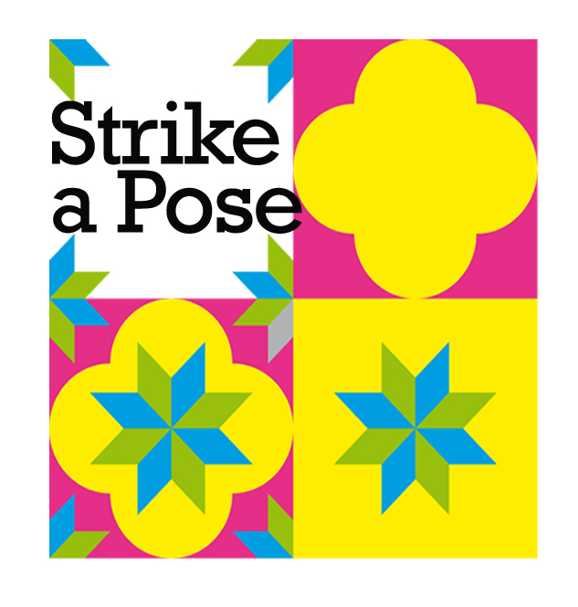

# ReInHerit Strike-a-pose

This application is part of the **ReInHerit Toolkit**.




**Gamification** is the process of exploiting strategies and game dynamics into scenarios that are not a game. 
It has already been proved to be useful to enhance skills and competences in a variety of domains such as marketing, industry training and entertainment.
Also, cultural heritage can benefit from a gamification approach which represents an opportunity to **engage visitors** to museums contents through the design of more entertaining, social and challenging digital learning scenarios, to help museums to move from the traditional “look and do not touch” toward a “play and interact” approach. 

Strike-a-pose is a web application which performs analysis and evaluation of human poses compared to poses present in famous paintings or statues. 
The user is challenged to reproduce in sequence the poses of some artworks from the museum's collections. 
Once all the poses have been matched, the application allows the user to **generate a video** that can be saved for any social sharing and provide info on the artworks. 
The video shows the user matching process and the overall interactive experience lived at the museum.

This app won a Best Demo Honorable Mention award at ACM Multimedia 2022, the foremost conference on multimedia.


## System set-up
### Prerequisites
In order to run this demo you need these software installed on your computer:
- [Docker](https://docs.docker.com/get-docker/)
- [Docker-compose](https://docs.docker.com/compose/install/)
- Python 3.10 (or higher)
#### Email setup
To send emails to the users, the system needs to be configured with a valid Gmail account. Then, you will need to generate an App Password by following the instructions provided in the first point on this link: https://www.interviewqs.com/blog/py-email.

After generating the App Password, you will need to enter it, along with your email address, into a copy of the `back-end/.env_template` file. Additionally, make sure to remove the **_template** part of the file name, so the updated file should be named ___.env___. This configuration file, .env, will then be used by the application to authenticate with the email service.
#### Flask secret key setup
To generate a secret key for the flask application, in a console navigate to strike-a-pose/back-end/static/utility/ then use the following command:
```
python generate_secret_key.py
```
Then copy the generated key and paste it in the file .env file generated above, in the variable SECRET_KEY.


#### Superuser generation
To efficiently manage the database, a superuser is initially required. Follow these steps for superuser generation:
1) open `back-end/superuser.py` with your preferred Integrated Development Environment (IDE) and locate the following lines: 
```
superuser = User(
        username='superadmin',
        email='superadmin@example.com',  # Set a unique and non-null email
        is_superuser=True,
        registered=True,  
        confirmed=True,  
    )
superuser.set_password('superadminpassword')
```
Replace ___superadmin___, ___superadmin@example.com___ and ___superadminpassword___ with your desired username, email and password.

2) in the console navigate to `back-end/` folder then use the following command:
```
python superuser.py
```
The superuser can:
- add new artworks to the database;
- delete artworks from the database;
- accept new admin user registrations;
- delete admin users.


### Docker setup

Be sure that **back-end/.env** file is correctly set up with the email and secret key configurations and that the file is added to .dockerignore and .gitignore
Build the docker image with:

```
docker build -t strike . 
```
then run it with the following command:
```
docker run --env-file=back-end/.env -p 8000:8000 strike  
```
### Browse to the application
Open a web browser and go to the address: _localhost:8000_. 
If security warnings appear, ignore them and proceed to the website.

### New Admin user generation
You can also generate a new admin user by following these steps:
1. Access the admin page by clicking on the ___ADMIN___ button located in the top-right corner of the screen. This action will redirect you to the admin page.
2. Click on ___SignUp tab___ and fill the form with the requested field.
3. A confirmation email will be sent to the email address provided. Click on the link in the email to confirm the registration.
4. Next step is to wait for the superuser acceptance. Once the superuser has accepted the registration, you could log in with the credentials provided.
An Admin user can:
- add new artworks to the database;
- delete artworks from the database.
- 
### To change the artworks that are shown in the system, follow the following steps:
1. Select the ___ADMIN___ button located in the top-right corner of the screen. This action will redirect you to the admin page.
2. Log in with a superuser or admin credentials;
3. You are now able to manage artworks in the database through the following options:
   - ADD: 
     - A pop-up will prompt you to input the author's name, artwork name, description, category type and upload an image of the artwork.
     - Click on "Choose File" to select an image from your hard disk. Note that the image must be in either .jpg or .png format.
     - In the description field, the text can be formatted to include links to further websites. This will be the text that will be sent via email to the users.
     - As for the categories, it's possible to select an existing category or enter a new one by choosing "New Category" in the first selection window.
     - Press "**Add Artwork**" to include it in the database.
     - The image will be stored in the corresponding folder for the category, located at `back-end/static/assets/<category>` (e.g. `back-end/static/assets/halfBust` for half-length pose and `back-end/static/assets/fullLength` for full-length pose); 
   - EDIT:
     - you can edit the author's name, artwork name, category type, and description of the artwork clicking on the corresponding cell of the table. 
   - DELETE: 
     - Click on the button associated with the row of the artwork you wish to delete.
     - A pop-up will appear, seeking confirmation for the deletion.
     - Click on "Delete" to confirm the deletion process.
### How to play the game
1. Visit http://localhost:8000 

2. Confirm the policy to proceed. 

3. Set up the challenge choosing:
  - POSES: Specify the number of artworks to include in the game (1-4).
  - CHALLENGE: Select the game level from one of those available.

4. Start the game by clicking on "PLAY" button.

5. Try to match the poses in the displayed artworks.

6. After successfully matching all poses, input your email address to send you the video of your performance.


## Citation

If you use this software in your work please cite:

```
@inproceedings{acmmm-22,
	author = {Donadio, Maria Giovanna and Principi, Filippo and Ferracani, Andrea and Bertini, Marco and Del Bimbo, Alberto},
	booktitle = {Proc. of ACM International Conference on Multimedia (ACM MM)},
	doi = {10.1145/3503161.3547744},
	isbn = {9781450392037},
	keywords = {gamification, face pose, cultural heritage, body pose},
	location = {Lisboa, Portugal},
	numpages = {3},
	pages = {7000--7002},
	publisher = {Association for Computing Machinery},
	series = {MM '22},
	title = {Engaging Museum Visitors with Gamification of Body and Facial Expressions},
	url = {https://doi.org/10.1145/3503161.3547744},
	year = {2022},
	bdsk-url-1 = {https://doi.org/10.1145/3503161.3547744}
}
```

## Acknowledgements
This work was partially supported by the European Commission under European Horizon 2020 Programme, grant number 101004545 - [ReInHerit](https://www.reinherit.eu).